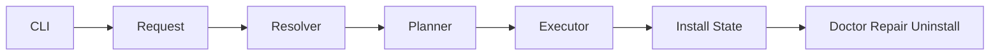

# EFD Selective Install Architecture

## Purpose

This document describes the internal architecture for selective install in
Everything Factory Droid as a Factory Droid-only system.

The user-facing design lives in `docs/SELECTIVE-INSTALL-DESIGN.md`. This file
focuses on runtime layers, data contracts, and lifecycle reuse.

## Scope

Selective install should answer, deterministically:

- what was requested
- what was resolved
- what would be written
- what was actually written
- what EFD owns and may repair or remove later

## Current Foundation

The current repo already contains the substrate needed for this model:

- `manifests/install-modules.json`
- `manifests/install-profiles.json`
- `schemas/install-*.schema.json`
- `scripts/ci/validate-install-manifests.js`
- `scripts/lib/install-manifests.js`
- `scripts/lib/install/request.js`
- `scripts/lib/install/runtime.js`
- `scripts/lib/install/apply.js`
- `scripts/lib/install-targets/`
- `scripts/lib/install-state.js`
- `scripts/lib/install-executor.js`
- `scripts/lib/install-lifecycle.js`
- `scripts/install-apply.js`
- `scripts/install-plan.js`
- `scripts/list-installed.js`
- `scripts/doctor.js`
- `scripts/repair.js`
- `scripts/uninstall.js`

## Single-Target Assumption

The architecture should now assume one packaged project target:

- project destination: `.factory/`
- project settings: `.factory/settings.json`
- project-owned install state: EFD-managed metadata for repair/uninstall

Legacy compatibility may still accept older flags or entrypoints, but all roads
should normalize to the same Factory Droid install model.

## Target Runtime Flow



## Runtime Layers

### 1. CLI Surface

Responsibilities:

- parse user intent
- route to install, plan, doctor, repair, uninstall, list-installed
- render human or JSON output

Should stay thin.

### 2. Request Normalizer

Responsibilities:

- turn raw flags into a canonical request
- map legacy syntax into the same request model
- reject mixed or ambiguous inputs early

Example canonical request:

```json
{
  "mode": "manifest",
  "target": "factory-droid",
  "profile": "developer",
  "modules": ["lang:typescript"],
  "dryRun": false
}
```

The key point is that `target` is no longer a branching UX concern. It should
collapse to one internal constant.

### 3. Module Resolver

Responsibilities:

- load profile and module catalogs
- expand dependencies
- reject conflicts
- return a stable resolution object

This layer should stay read-only and path-agnostic.

### 4. Target Planner

Responsibilities:

- resolve the install root
- map modules to `.factory/` destinations
- compute install-state location
- emit target-aware operation intents

Because the target is singular, this layer should become simpler and more
predictable than the earlier multi-target design.

### 5. Operation Planner

Responsibilities:

- materialize copy / merge / generate / remove intents
- describe each managed path explicitly
- support dry-run output without mutation

Example operation shape:

```json
{
  "type": "copy",
  "source": "skills/verification-loop/SKILL.md",
  "destination": ".factory/skills/verification-loop/SKILL.md",
  "module": "workflow-quality"
}
```

### 6. Executor

Responsibilities:

- apply the planned operations
- collect execution results
- write durable install-state only after successful mutation

The executor should not decide install semantics on its own. It should execute a
plan, not invent one.

### 7. Install-State Persistence

Responsibilities:

- store the normalized request
- store the resolved modules
- store the executed operations
- store enough metadata for doctor, repair, and uninstall

This contract is the backbone of lifecycle safety.

### 8. Lifecycle Services

`doctor`, `repair`, `list-installed`, and `uninstall` should reuse the same
install-state model instead of reconstructing behavior from guessed paths.

## Suggested Data Contracts

### Normalized Request

```json
{
  "mode": "manifest",
  "target": "factory-droid",
  "profile": "developer",
  "modules": ["framework:nextjs"],
  "without": ["capability:media"],
  "dryRun": false
}
```

### Resolution Result

```json
{
  "profile": "developer",
  "selectedModules": ["agents-core", "commands-core", "framework-nextjs"],
  "warnings": []
}
```

### Operation Plan

```json
{
  "root": ".factory",
  "statePath": ".factory/install-state.json",
  "operations": []
}
```

### Install State

```json
{
  "version": 1,
  "target": "factory-droid",
  "requested": {},
  "resolved": {},
  "applied": []
}
```

## Simplified Adapter Strategy

Earlier architecture notes treated target adapters as first-class design work.
For the current repo, that should collapse to a single Factory Droid project
adapter with clear responsibilities:

- resolve `.factory/` root
- choose settings destination
- map commands / skills / droids to packaged paths
- expose install-state path

If additional install modes ever return, they should be additive adapters on top
of this design rather than the default framing of the system.

## Mirror Semantics

Selective install should respect the repo's current source-of-truth model:

- canonical content is maintained in source directories
- packaged files land in `.factory/`
- install planning should describe packaged output explicitly
- lifecycle tools should only manage files that the recorded plan owns

## Compatibility Layer

Legacy `efd-install` behavior should survive as a request adapter only.

That means:

- accept older invocation styles when helpful
- normalize them immediately
- route them through the same planner, executor, and install-state services

This avoids maintaining two installer architectures.

## Open Architecture Work

1. keep the planner / executor boundary strict
2. keep install-state rich enough for safe repair and uninstall
3. reduce remaining path heuristics in executor code
4. keep manifests and packaged mirrors aligned with the real repo structure
5. document operation semantics well enough that lifecycle commands remain
   predictable

## Summary

Selective install no longer needs to solve "which harness do we target?" The
architecture should optimize for one thing: reliable, inspectable installation
of the right EFD surface into Factory Droid projects.
