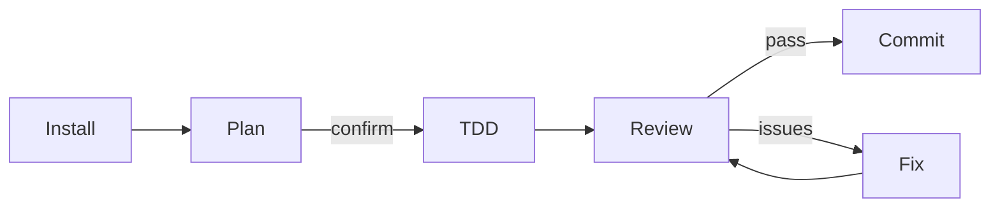

# Factory Droid Usage Examples

> Practical, end-to-end examples for everything from first install to advanced multi-agent orchestration.
>
> **Related guides:** [Shorthand Guide](../the-shortform-guide.md) | [Longform Guide](../the-longform-guide.md) | [Commands Quick Ref](../COMMANDS-QUICK-REF.md) | [简体中文](zh-CN/USAGE-EXAMPLES.md)

---

## Table of Contents

1. [Quick Start After Install](#1-quick-start-after-install)
2. [Core Workflow Scenarios](#2-core-workflow-scenarios)
   - [New Feature Development](#21-new-feature-development)
   - [Bug Fix](#22-bug-fix)
   - [Code Review and Security Audit](#23-code-review-and-security-audit)
   - [Refactor and Cleanup](#24-refactor-and-cleanup)
3. [Multi-Language Project Examples](#3-multi-language-project-examples)
4. [Session Management and Memory](#4-session-management-and-memory)
5. [Multi-Agent and Parallel Execution](#5-multi-agent-and-parallel-execution)
6. [Advanced: Hooks, Skills, and Customization](#6-advanced-hooks-skills-and-customization)
7. [Quick Decision Cheatsheet](#7-quick-decision-cheatsheet)

---

## 1. Quick Start After Install

### Verify Installation

After installing the plugin, confirm it is loaded:

```bash
droid plugin list
```

Expected output:

```
Installed plugins:
  everything-factory-droid@everything-factory-droid  (active)
```

### Overall Workflow at a Glance



### Your First Plan

Paste a feature description into a Factory Droid session. The plugin form uses the namespace prefix; manual installs use the short form.

```
# Plugin install
/everything-factory-droid:plan "Add JWT authentication to the Express API"

# Manual install
/plan "Add JWT authentication to the Express API"
```

The `planner` agent restates requirements, breaks work into numbered phases, lists dependencies and risks, and then **waits**. Do not let it write code yet — read the plan and either confirm or adjust it.

```
WAITING FOR CONFIRMATION: Proceed with this plan? (yes / no / modify: <changes>)
```

Reply `yes` or `modify: skip phase 3, add Redis session store instead`.

### Your First TDD Cycle

After confirming the plan, invoke TDD:

```
/tdd
```

The `tdd-guide` agent walks you through:

1. **RED** — write a failing test first
2. **GREEN** — implement minimal code to pass
3. **REFACTOR** — clean up, verify coverage stays above 80 %

---

## 2. Core Workflow Scenarios

### 2.1 New Feature Development

**Goal:** Add a product search endpoint to an existing REST API.

#### Workflow

```mermaid
flowchart TD
    Start([Feature request]) --> Plan[/plan]
    Plan -->|approved| TDD[/tdd]
    TDD --> BuildFail{Build error?}
    BuildFail -->|yes| BuildFix[/build-fix]
    BuildFix --> TDD
    BuildFail -->|no| Review[/code-review]
    Review -->|issues| Fix[fix in editor]
    Fix --> Review
    Review -->|clean| Done([commit])
```

#### Step 1 — Plan

```
/plan "Add GET /products/search?q= endpoint with pagination"
```

Planner output (abbreviated):

```
## Requirements Restatement
Search products by name or description. Return paginated results (page, pageSize, total).

## Phases
### Phase 1: Route + Controller
- Add GET /products/search route in routes/products.ts
- Create searchProducts controller function

### Phase 2: Service Layer
- Add ProductService.search(query, page, pageSize)
- Use ILIKE for case-insensitive match

### Phase 3: Tests
- Unit: service layer with mock DB
- Integration: route handler

### Phase 4: Validation
- Validate q (required, min 2 chars)
- Validate page/pageSize (positive integers, max pageSize 100)

## Risks
- MEDIUM: Full-text search performance at scale — add index if needed
- LOW: XSS via query param — validated and parameterized

WAITING FOR CONFIRMATION: Proceed?
```

Reply `yes`.

#### Step 2 — TDD

```
/tdd
```

Agent scaffolds the test first:

```typescript
// tests/products.search.test.ts
describe('GET /products/search', () => {
  it('returns matching products', async () => {
    const res = await request(app).get('/products/search?q=widget')
    expect(res.status).toBe(200)
    expect(res.body.data).toBeInstanceOf(Array)
    expect(res.body.total).toBeGreaterThanOrEqual(0)
  })

  it('rejects missing q param', async () => {
    const res = await request(app).get('/products/search')
    expect(res.status).toBe(400)
  })
})
```

Run tests — they fail (RED). Implement the route, run again — they pass (GREEN). Refactor.

#### Step 3 — Code Review

```
/code-review
```

Example output:

```
## Code Review — searchProducts

### CRITICAL
(none)

### HIGH
- routes/products.ts:47 — pageSize not capped; a caller can pass 10000. Add: if (pageSize > 100) pageSize = 100

### MEDIUM
- services/ProductService.ts:22 — missing index on products.name; add: CREATE INDEX idx_products_name ON products(name)

### LOW
- Consistent use of async/await, proper error propagation. No hardcoded credentials.

### Recommendation: NEEDS WORK — fix HIGH finding before merging.
```

Fix the HIGH finding, then commit.

---

### 2.2 Bug Fix

**Goal:** Users report that the password reset link expires too quickly (15 min instead of 24 h).

#### Workflow

```mermaid
flowchart TD
    Report([Bug report]) --> Repro[write failing test]
    Repro --> TDD[/tdd]
    TDD --> Root[identify root cause]
    Root --> Fix[fix constant]
    Fix --> Green[tests pass]
    Green --> Review[/code-review]
    Review --> Commit([commit])
```

#### Step 1 — Reproduce with a Test

```
/tdd "Password reset token should expire in 24 hours, not 15 minutes"
```

Agent writes the failing test:

```typescript
it('reset token expires in 24 hours', () => {
  const token = generateResetToken(userId)
  const decoded = jwt.decode(token) as any
  const ttl = decoded.exp - decoded.iat
  expect(ttl).toBe(24 * 60 * 60) // 86400 seconds
})
```

Test fails — confirms the bug.

#### Step 2 — Fix

```typescript
// Before
const RESET_TOKEN_TTL = 15 * 60 // 900 seconds

// After
const RESET_TOKEN_TTL = 24 * 60 * 60 // 86400 seconds
```

Test passes.

#### Step 3 — Review and Commit

```
/code-review
```

No new issues. Commit: `fix: extend password reset token TTL to 24 hours`.

---

### 2.3 Code Review and Security Audit

**Goal:** Review a PR that adds file upload before it merges to main.

#### Workflow

```mermaid
flowchart TD
    PR([PR opened]) --> CR[/code-review]
    CR --> SS[/security-scan]
    SS --> Findings{critical?}
    Findings -->|yes| Block[block PR]
    Block --> Fix[fix & re-scan]
    Fix --> SS
    Findings -->|no| Merge([approve & merge])
```

#### Step 1 — Code Review

```
/code-review
```

#### Step 2 — Security Scan

```
/security-scan
```

Example output:

```
## Security Scan — file upload handler

### CRITICAL
- uploads/handler.ts:34 — no MIME type validation; attacker can upload .php/.exe
  Fix: allowlist ['image/jpeg','image/png','application/pdf']

### HIGH
- uploads/handler.ts:51 — original filename used in path without sanitisation
  Fix: use uuid for stored filename, store original in DB only

### MEDIUM
- No file size limit enforced server-side (only client-side)
  Fix: add multer({ limits: { fileSize: 10 * 1024 * 1024 } })

### Recommendation: BLOCKED — fix CRITICAL and HIGH before merge.
```

#### Step 3 — Fix Findings

```typescript
// uploads/handler.ts (after fixes)
const ALLOWED_TYPES = ['image/jpeg', 'image/png', 'application/pdf']
const upload = multer({
  limits: { fileSize: 10 * 1024 * 1024 },
  fileFilter: (_req, file, cb) => {
    cb(null, ALLOWED_TYPES.includes(file.mimetype))
  },
  storage: multer.diskStorage({
    filename: (_req, _file, cb) => cb(null, `${uuid()}`),
  }),
})
```

Re-run `/security-scan` — CRITICAL and HIGH resolved. Approve the PR.

---

### 2.4 Refactor and Cleanup

**Goal:** Remove dead code after a major feature flag was permanently enabled.

```
/refactor-clean
```

Agent identifies:

- Unused functions referencing the old flag
- Duplicate utility helpers across 3 files
- Commented-out code blocks

After cleanup:

```
/verify
```

Runs build + lint + tests. Then confirm coverage:

```
/test-coverage
```

---

## 3. Multi-Language Project Examples

### Language-Specific Command Map

| Language | Review | Test | Build Fix | Patterns Skill |
|----------|--------|------|-----------|----------------|
| TypeScript / JS | `/code-review` | `/tdd` | `/build-fix` | `coding-standards` |
| Go | `/go-review` | `/go-test` | `/go-build` | `golang-patterns` |
| Python | `/python-review` | `/tdd` | `/build-fix` | `python-patterns` |
| Java / Spring | `/code-review` | `/tdd` | `/build-fix` | `springboot-patterns` |
| Kotlin | `/kotlin-review` (via agent) | `/tdd` | `/kotlin-build` | `kotlin-patterns` |
| Rust | `/rust-review` (via agent) | `/rust-test` | `/rust-build` | `rust-patterns` |
| C++ | `/cpp-review` (via agent) | `/cpp-test` | `/cpp-build` | `cpp-coding-standards` |
| PHP / Laravel | `/code-review` | `/tdd` | `/build-fix` | `laravel-patterns` |

### 3.1 TypeScript — Adding a React Hook

```
/plan "Add useProductSearch hook with debouncing and error state"
```

After confirmation:

```
/tdd
```

TDD cycle for the hook:

```typescript
// hooks/__tests__/useProductSearch.test.ts
it('debounces search requests', async () => {
  const { result } = renderHook(() => useProductSearch())
  act(() => result.current.setQuery('wi'))
  act(() => result.current.setQuery('wid'))
  act(() => result.current.setQuery('widg'))
  await waitFor(() => expect(mockFetch).toHaveBeenCalledTimes(1)) // one call after debounce
})
```

### 3.2 Go — Table-Driven Tests

```
/go-test "Add unit tests for the inventory service"
```

Agent generates Go table-driven tests following the `golang-testing` skill patterns:

```go
func TestInventoryService_Reserve(t *testing.T) {
  tests := []struct {
    name    string
    sku     string
    qty     int
    wantErr bool
  }{
    {"sufficient stock", "SKU-001", 5, false},
    {"insufficient stock", "SKU-002", 999, true},
    {"zero quantity", "SKU-001", 0, true},
  }
  for _, tt := range tests {
    t.Run(tt.name, func(t *testing.T) {
      err := svc.Reserve(tt.sku, tt.qty)
      if (err != nil) != tt.wantErr {
        t.Errorf("Reserve() error = %v, wantErr %v", err, tt.wantErr)
      }
    })
  }
}
```

Then `go-review` checks for idiomatic patterns:

```
/go-review
```

### 3.3 Python / Django

```
/python-review
```

The `python-reviewer` agent checks PEP 8, type hints, Django ORM patterns, and N+1 queries.

---

## 4. Session Management and Memory

### The Session Lifecycle

```mermaid
flowchart TD
    Start([new session]) --> Load[auto-load context\nhook fires]
    Load --> Work[develop...]
    Work --> Heavy{context heavy?}
    Heavy -->|yes| Budget[/context-budget]
    Budget --> CKP[/checkpoint]
    CKP --> Work
    Heavy -->|no| Done{done for day?}
    Done -->|yes| Learn[/learn-eval]
    Learn --> Save[/save-session]
    Save --> End([session ends])
    End --> Next([next session])
    Next --> Resume[/resume-session]
    Resume --> Work
```

### 4.1 Saving and Resuming

At the end of a productive session:

```
/learn-eval
```

This extracts reusable patterns and self-evaluates their quality before saving.

```
/save-session
```

Writes current state to `~/.factory/session-data/`.

Next day, open a new session:

```
/resume-session
```

Loads the previous state summary and picks up where you left off.

### 4.2 Checkpoint During Long Sessions

When a context-heavy refactor is underway:

```
/context-budget
```

Example output:

```
Context utilization: 67%

Largest consumers:
  AGENTS.md             4,200 tokens
  Active skills (8)    12,400 tokens
  Conversation so far  18,900 tokens

Recommendation: checkpoint soon, approach 80% carefully.
```

Then:

```
/checkpoint
```

Saves a recovery point. If anything goes wrong, the checkpoint file in `.factory/` lets you restore context quickly.

### 4.3 Pattern Extraction and Skill Evolution

After several sessions solving the same class of problem:

```
/instinct-status
```

Shows accumulated instincts with confidence scores:

```
Project instincts (my-app):
  [0.91] always-add-index-for-fk    — trigger: "adding a foreign key"
  [0.84] prefer-service-layer       — trigger: "direct DB call in controller"
  [0.78] zod-for-api-validation     — trigger: "validating request body"

Global instincts (3):
  [0.95] conventional-commits       — trigger: "writing a commit message"
```

Promote confident instincts to a reusable skill:

```
/evolve
```

The agent clusters related instincts and generates a `SKILL.md` file you can commit to your project.

---

## 5. Multi-Agent and Parallel Execution

### Task Decomposition and Parallel Agents

```mermaid
flowchart TD
    Task([complex task]) --> MultiPlan[/multi-plan]
    MultiPlan --> Split{decompose}
    Split --> A1[agent: backend]
    Split --> A2[agent: frontend]
    Split --> A3[agent: tests]
    A1 --> Merge[merge results]
    A2 --> Merge
    A3 --> Merge
    Merge --> Review[/code-review]
    Review --> Done([ship])
```

### 5.1 Multi-Plan for Complex Tasks

```
/multi-plan "Implement real-time order tracking with WebSocket and a React dashboard"
```

The multi-plan command breaks the request into independent workstreams and assigns the right agent to each:

```
## Workstream 1: WebSocket Server (backend team)
  Owner: tdd-guide + code-reviewer
  Files: server/websocket.ts, server/orderTracker.ts

## Workstream 2: React Dashboard (frontend team)
  Owner: tdd-guide + typescript-reviewer
  Files: components/OrderTracker.tsx, hooks/useOrderSocket.ts

## Workstream 3: Integration Tests
  Owner: e2e-runner
  Files: tests/e2e/orderTracking.spec.ts

Proceed? (yes / modify)
```

### 5.2 Parallel Worktrees with /orchestrate

For long-running, fully-isolated parallel sessions using tmux and git worktrees:

```
/orchestrate
```

The skill guides you through:

```bash
# Create isolated worktrees
git worktree add ../my-app-backend feat/order-ws-backend
git worktree add ../my-app-frontend feat/order-ws-frontend

# Open separate tmux panes
tmux new-window -n "backend"  "cd ../my-app-backend  && droid"
tmux new-window -n "frontend" "cd ../my-app-frontend && droid"
```

Each pane is a full, independent Factory Droid session with its own context window.

### 5.3 DevFleet for Cloud-Parallel Agents

```
/devfleet "Implement the payment gateway integration across 4 parallel agents"
```

DevFleet dispatches agents in isolated worktrees and returns a merged report when all finish.

---

## 6. Advanced: Hooks, Skills, and Customization

### 6.1 Custom Hook — Pre-Edit TypeScript Check

Add to your `hooks/hooks.json` (or `~/.factory/settings.json`):

```json
{
  "PreToolUse": [
    {
      "matcher": "tool == \"Edit\" && tool_input.file_path matches \"\\.tsx?$\"",
      "hooks": [
        {
          "type": "command",
          "command": "echo '[Hook] TypeScript file edit — run tsc --noEmit after changes' >&2"
        }
      ]
    }
  ]
}
```

This fires before every TypeScript file edit, reminding you to type-check when done.

### 6.2 Creating a Skill from Git History

After working on a project for a few weeks, generate a skill that captures your team's patterns:

```
/skill-create
```

```
/skill-create --instincts        # also populate continuous-learning-v2
/skill-create --commits 300      # analyze last 300 commits
```

Output example for a Django project:

```markdown
---
name: my-django-app-patterns
description: Coding patterns extracted from my-django-app
version: 1.0.0
source: local-git-analysis
analyzed_commits: 187
---

# My Django App Patterns

## Commit Conventions
- feat:, fix:, docs:, refactor: — 94% of commits
- Always link issue: "feat(auth): add OAuth2 — closes #47"

## Architecture
- Views in views/<domain>.py
- Serializers in serializers/<domain>.py
- Tests mirror source tree: tests/<domain>/test_*.py

## Workflows
### Adding an API Endpoint
1. Add URL in urls/<domain>.py
2. Create view in views/<domain>.py
3. Write serializer in serializers/<domain>.py
4. Add test in tests/<domain>/test_views.py
```

Commit the generated skill to your project so every Droid session benefits from it.

### 6.3 The Continuous Learning Loop

```mermaid
flowchart LR
    Session --> Learn[/learn-eval]
    Learn --> Instincts[(instincts store)]
    Instincts --> Evolve[/evolve]
    Evolve --> Skill[SKILL.md]
    Skill --> Session
```

Run this loop regularly:

```
# After finishing work
/learn-eval

# Weekly: cluster instincts into structured skills
/instinct-status
/evolve
```

### 6.4 AGENTS.md Customization

Place an `AGENTS.md` in your project root to override default behavior. See `examples/` for templates:

| Template | Stack |
|----------|-------|
| `examples/saas-nextjs-AGENTS.md` | Next.js + Supabase + Stripe |
| `examples/go-microservice-AGENTS.md` | Go + gRPC + PostgreSQL |
| `examples/django-api-AGENTS.md` | Django + DRF + Celery |
| `examples/laravel-api-AGENTS.md` | Laravel + PostgreSQL + Redis |
| `examples/rust-api-AGENTS.md` | Rust + Axum + SQLx |

Minimal example:

```markdown
# My Project

## Stack
Next.js 15, TypeScript, Supabase, Tailwind CSS

## Rules
- No emojis in code or comments
- 80 % test coverage minimum
- Use Zod for all input validation

## Key Commands
- /plan     — before any feature
- /tdd      — always test-first
- /security-scan  — before merging auth changes
```

---

## 7. Quick Decision Cheatsheet

| I want to... | Command / Skill | Agent invoked |
|--------------|-----------------|---------------|
| Plan a new feature before coding | `/plan "feature desc"` | planner |
| Write code test-first | `/tdd` | tdd-guide |
| Review code I just wrote | `/code-review` | code-reviewer |
| Find security vulnerabilities | `/security-scan` | security-reviewer |
| Fix a failing build | `/build-fix` | build-error-resolver |
| Run E2E tests | `/e2e` | e2e-runner |
| Remove dead code | `/refactor-clean` | refactor-cleaner |
| Review Go code | `/go-review` | go-reviewer |
| Review Python code | `/python-review` | python-reviewer |
| Look up library docs | `/docs <library>` | docs-lookup |
| Save session before ending | `/save-session` | — |
| Resume yesterday's work | `/resume-session` | — |
| Check context window usage | `/context-budget` | — |
| Extract patterns from this session | `/learn-eval` | — |
| Turn instincts into a skill | `/evolve` | — |
| Generate skill from git history | `/skill-create` | — |
| Run parallel multi-agent work | `/multi-plan` | planner + agents |
| Configure package manager | `/setup-pm` | — |
| Audit hook/agent config | `/harness-audit` | harness-optimizer |

### Common Sequences

```
# Starting a new feature
/plan "Add X"  →  /tdd  →  /code-review  →  commit

# Bug fix
/tdd "reproduce bug"  →  fix  →  /code-review  →  commit

# Pre-release gate
/security-scan  →  /e2e  →  /test-coverage  →  ship

# End of day
/learn-eval  →  /save-session

# Next morning
/resume-session  →  continue
```

---

> **More resources:**
> - [Shorthand Guide](../the-shortform-guide.md) — foundations, setup, hooks, subagents
> - [Longform Guide](../the-longform-guide.md) — token optimization, memory persistence, parallelization
> - [Commands Quick Reference](../COMMANDS-QUICK-REF.md) — full 79-command listing
> - [Skill Development Guide](SKILL-DEVELOPMENT-GUIDE.md) — write your own skills
> - [Token Optimization](token-optimization.md) — cut costs and extend context
