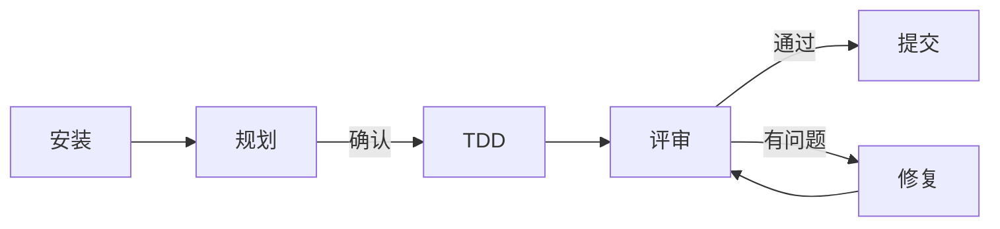

# Factory Droid 使用示例

> 从安装完成到高级多智能体编排的端到端实用示例。
>
> **相关文档：** [简明指南](../../the-shortform-guide.md) | [详细指南](../../the-longform-guide.md) | [命令速查表](../../COMMANDS-QUICK-REF.md) | [English](../USAGE-EXAMPLES.md)

---

## 目录

1. [安装后快速开始](#1-安装后快速开始)
2. [核心工作流场景](#2-核心工作流场景)
   - [新功能开发](#21-新功能开发)
   - [Bug 修复](#22-bug-修复)
   - [代码评审与安全审计](#23-代码评审与安全审计)
   - [重构与清理](#24-重构与清理)
3. [多语言项目示例](#3-多语言项目示例)
4. [会话管理与记忆](#4-会话管理与记忆)
5. [多智能体与并行执行](#5-多智能体与并行执行)
6. [进阶：Hooks、Skills 与自定义](#6-进阶hooksskills-与自定义)
7. [快速决策速查表](#7-快速决策速查表)

---

## 1. 安装后快速开始

### 验证安装

安装插件后，确认它已加载：

```bash
droid plugin list
```

预期输出：

```
Installed plugins:
  everything-factory-droid@everything-factory-droid  (active)
```

### 整体工作流一览



### 第一次使用 /plan

在 Factory Droid 会话中粘贴功能需求。插件安装使用命名空间前缀；手动安装使用短命令形式。

```
# 插件安装形式
/everything-factory-droid:plan "为 Express API 添加 JWT 身份验证"

# 手动安装形式
/plan "为 Express API 添加 JWT 身份验证"
```

`planner` 智能体会重新描述需求、将工作拆分为有编号的阶段、列出依赖和风险，然后**等待确认**。此时不要让它写代码——先阅读计划，再确认或调整。

```
WAITING FOR CONFIRMATION: Proceed with this plan? (yes / no / modify: <changes>)
```

回复 `yes` 或 `modify: 跳过第 3 阶段，改用 Redis Session`。

### 第一次 TDD 循环

确认计划后，启动 TDD：

```
/tdd
```

`tdd-guide` 智能体引导你完成：

1. **RED** — 先写一个失败的测试
2. **GREEN** — 用最少代码让测试通过
3. **REFACTOR** — 整理代码，确保覆盖率保持在 80% 以上

---

## 2. 核心工作流场景

### 2.1 新功能开发

**目标：** 为现有 REST API 增加商品搜索端点。

#### 工作流

```mermaid
flowchart TD
    开始([功能需求]) --> Plan[/plan]
    Plan -->|已批准| TDD[/tdd]
    TDD --> BuildFail{构建错误?}
    BuildFail -->|是| BuildFix[/build-fix]
    BuildFix --> TDD
    BuildFail -->|否| Review[/code-review]
    Review -->|有问题| Fix[在编辑器中修复]
    Fix --> Review
    Review -->|通过| Done([提交])
```

#### 第一步 — 规划

```
/plan "添加 GET /products/search?q= 端点，支持分页"
```

Planner 输出（节选）：

```
## 需求重述
按名称或描述搜索商品。返回分页结果（page、pageSize、total）。

## 阶段
### 阶段 1：路由 + Controller
- 在 routes/products.ts 添加 GET /products/search 路由
- 创建 searchProducts controller 函数

### 阶段 2：服务层
- 添加 ProductService.search(query, page, pageSize)
- 使用 ILIKE 实现大小写不敏感匹配

### 阶段 3：测试
- 单元测试：使用 mock DB 测试服务层
- 集成测试：路由处理器

### 阶段 4：校验
- 校验 q（必填，最少 2 字符）
- 校验 page/pageSize（正整数，pageSize 上限 100）

## 风险
- MEDIUM：大数据量下全文搜索性能——如需可添加索引
- LOW：查询参数 XSS——已校验并参数化

WAITING FOR CONFIRMATION: Proceed?
```

回复 `yes`。

#### 第二步 — TDD

```
/tdd
```

智能体先搭建测试：

```typescript
// tests/products.search.test.ts
describe('GET /products/search', () => {
  it('返回匹配商品', async () => {
    const res = await request(app).get('/products/search?q=widget')
    expect(res.status).toBe(200)
    expect(res.body.data).toBeInstanceOf(Array)
    expect(res.body.total).toBeGreaterThanOrEqual(0)
  })

  it('拒绝缺少 q 参数的请求', async () => {
    const res = await request(app).get('/products/search')
    expect(res.status).toBe(400)
  })
})
```

运行测试——失败（RED）。实现路由，再次运行——通过（GREEN）。重构。

#### 第三步 — 代码评审

```
/code-review
```

示例输出：

```
## 代码评审 — searchProducts

### CRITICAL
（无）

### HIGH
- routes/products.ts:47 — pageSize 未设上限；调用方可传入 10000
  修复：if (pageSize > 100) pageSize = 100

### MEDIUM
- services/ProductService.ts:22 — products.name 缺少索引
  修复：CREATE INDEX idx_products_name ON products(name)

### LOW
- 一致使用 async/await，错误正确传播。无硬编码凭据。

### 建议：NEEDS WORK — 修复 HIGH 问题后再合并。
```

修复 HIGH 问题，提交。

---

### 2.2 Bug 修复

**目标：** 用户反馈密码重置链接过期太快（15 分钟而非 24 小时）。

#### 工作流

```mermaid
flowchart TD
    报告([Bug 报告]) --> Repro[编写失败测试]
    Repro --> TDD[/tdd]
    TDD --> Root[定位根因]
    Root --> Fix[修复常量]
    Fix --> Green[测试通过]
    Green --> Review[/code-review]
    Review --> Commit([提交])
```

#### 第一步 — 用测试复现

```
/tdd "密码重置 token 应在 24 小时后过期，而非 15 分钟"
```

智能体编写失败测试：

```typescript
it('重置 token 在 24 小时后过期', () => {
  const token = generateResetToken(userId)
  const decoded = jwt.decode(token) as any
  const ttl = decoded.exp - decoded.iat
  expect(ttl).toBe(24 * 60 * 60) // 86400 秒
})
```

测试失败——确认 bug 存在。

#### 第二步 — 修复

```typescript
// 修复前
const RESET_TOKEN_TTL = 15 * 60 // 900 秒

// 修复后
const RESET_TOKEN_TTL = 24 * 60 * 60 // 86400 秒
```

测试通过。

#### 第三步 — 评审并提交

```
/code-review
```

无新问题。提交：`fix: 将密码重置 token 有效期延长至 24 小时`。

---

### 2.3 代码评审与安全审计

**目标：** 在文件上传 PR 合并到 main 前进行审查。

#### 工作流

```mermaid
flowchart TD
    PR([PR 已开启]) --> CR[/code-review]
    CR --> SS[/security-scan]
    SS --> Findings{有 Critical?}
    Findings -->|是| Block[阻止合并]
    Block --> Fix[修复并重新扫描]
    Fix --> SS
    Findings -->|否| Merge([批准并合并])
```

#### 第一步 — 代码评审

```
/code-review
```

#### 第二步 — 安全扫描

```
/security-scan
```

示例输出：

```
## 安全扫描 — 文件上传处理器

### CRITICAL
- uploads/handler.ts:34 — 无 MIME 类型校验；攻击者可上传 .php/.exe
  修复：allowlist ['image/jpeg','image/png','application/pdf']

### HIGH
- uploads/handler.ts:51 — 路径中直接使用原始文件名，未做清理
  修复：使用 uuid 作为存储文件名，仅在数据库中保留原始文件名

### MEDIUM
- 仅前端限制文件大小，服务端未限制
  修复：multer({ limits: { fileSize: 10 * 1024 * 1024 } })

### 建议：BLOCKED — 修复 CRITICAL 和 HIGH 后再合并。
```

#### 第三步 — 修复问题

```typescript
// uploads/handler.ts（修复后）
const ALLOWED_TYPES = ['image/jpeg', 'image/png', 'application/pdf']
const upload = multer({
  limits: { fileSize: 10 * 1024 * 1024 },
  fileFilter: (_req, file, cb) => {
    cb(null, ALLOWED_TYPES.includes(file.mimetype))
  },
  storage: multer.diskStorage({
    filename: (_req, _file, cb) => cb(null, `${uuid()}`),
  }),
})
```

重新运行 `/security-scan`——CRITICAL 和 HIGH 已解决。批准 PR。

---

### 2.4 重构与清理

**目标：** 某个功能 Flag 已永久启用，清除相关死代码。

```
/refactor-clean
```

智能体识别出：

- 引用旧 Flag 的废弃函数
- 散落在 3 个文件中的重复工具函数
- 注释掉的代码块

清理完毕后：

```
/verify
```

执行构建 + Lint + 测试。然后确认覆盖率：

```
/test-coverage
```

---

## 3. 多语言项目示例

### 语言专属命令对照表

| 语言 | 评审 | 测试 | 构建修复 | 模式 Skill |
|------|------|------|----------|------------|
| TypeScript / JS | `/code-review` | `/tdd` | `/build-fix` | `coding-standards` |
| Go | `/go-review` | `/go-test` | `/go-build` | `golang-patterns` |
| Python | `/python-review` | `/tdd` | `/build-fix` | `python-patterns` |
| Java / Spring | `/code-review` | `/tdd` | `/build-fix` | `springboot-patterns` |
| Kotlin | `/code-review`（kotlin-reviewer） | `/tdd` | `/kotlin-build` | `kotlin-patterns` |
| Rust | `/code-review`（rust-reviewer） | `/rust-test` | `/rust-build` | `rust-patterns` |
| C++ | `/code-review`（cpp-reviewer） | `/cpp-test` | `/cpp-build` | `cpp-coding-standards` |
| PHP / Laravel | `/code-review` | `/tdd` | `/build-fix` | `laravel-patterns` |

### 3.1 TypeScript — 添加 React Hook

```
/plan "添加带防抖和错误状态的 useProductSearch Hook"
```

确认后：

```
/tdd
```

Hook 的 TDD 循环：

```typescript
// hooks/__tests__/useProductSearch.test.ts
it('对搜索请求进行防抖', async () => {
  const { result } = renderHook(() => useProductSearch())
  act(() => result.current.setQuery('wi'))
  act(() => result.current.setQuery('wid'))
  act(() => result.current.setQuery('widg'))
  await waitFor(() => expect(mockFetch).toHaveBeenCalledTimes(1)) // 防抖后只发一次请求
})
```

### 3.2 Go — 表格驱动测试

```
/go-test "为库存服务添加单元测试"
```

智能体根据 `golang-testing` Skill 模式生成 Go 表格驱动测试：

```go
func TestInventoryService_Reserve(t *testing.T) {
  tests := []struct {
    name    string
    sku     string
    qty     int
    wantErr bool
  }{
    {"库存充足", "SKU-001", 5, false},
    {"库存不足", "SKU-002", 999, true},
    {"数量为零", "SKU-001", 0, true},
  }
  for _, tt := range tests {
    t.Run(tt.name, func(t *testing.T) {
      err := svc.Reserve(tt.sku, tt.qty)
      if (err != nil) != tt.wantErr {
        t.Errorf("Reserve() error = %v, wantErr %v", err, tt.wantErr)
      }
    })
  }
}
```

然后用 `go-review` 检查惯用模式：

```
/go-review
```

### 3.3 Python / Django

```
/python-review
```

`python-reviewer` 智能体检查 PEP 8、类型注解、Django ORM 模式和 N+1 查询问题。

---

## 4. 会话管理与记忆

### 会话生命周期

```mermaid
flowchart TD
    开始([新会话]) --> Load[Hook 自动加载\n上下文]
    Load --> Work[开发中...]
    Work --> Heavy{上下文较重?}
    Heavy -->|是| Budget[/context-budget]
    Budget --> CKP[/checkpoint]
    CKP --> Work
    Heavy -->|否| Done{今天结束?}
    Done -->|是| Learn[/learn-eval]
    Learn --> Save[/save-session]
    Save --> End([会话结束])
    End --> Next([下次会话])
    Next --> Resume[/resume-session]
    Resume --> Work
```

### 4.1 保存与恢复会话

在一个高效会话结束时：

```
/learn-eval
```

该命令在保存前提取可复用模式并自评质量。

```
/save-session
```

将当前状态写入 `~/.factory/session-data/`。

第二天开启新会话：

```
/resume-session
```

加载上次的状态摘要，从上次离开的地方继续。

### 4.2 长会话中的检查点

在进行大型重构时：

```
/context-budget
```

示例输出：

```
上下文使用率：67%

消耗最多的部分：
  AGENTS.md              4,200 tokens
  已激活 Skills (8)     12,400 tokens
  当前对话内容          18,900 tokens

建议：尽快打检查点，谨慎接近 80%。
```

然后：

```
/checkpoint
```

保存一个恢复点。`.factory/` 中的检查点文件可在出错时快速恢复上下文。

### 4.3 模式提取与 Skill 演化

在多次会话中反复解决同类问题后：

```
/instinct-status
```

显示积累的 Instincts 及置信度评分：

```
项目 Instincts (my-app)：
  [0.91] always-add-index-for-fk   — 触发："添加外键时"
  [0.84] prefer-service-layer      — 触发："Controller 中直接调用 DB"
  [0.78] zod-for-api-validation    — 触发："校验请求体时"

全局 Instincts (3)：
  [0.95] conventional-commits      — 触发："撰写提交信息时"
```

将置信度高的 Instinct 晋升为可复用 Skill：

```
/evolve
```

智能体将相关 Instinct 聚合，生成可提交到项目的 `SKILL.md` 文件。

---

## 5. 多智能体与并行执行

### 任务分解与并行智能体

```mermaid
flowchart TD
    任务([复杂任务]) --> MultiPlan[/multi-plan]
    MultiPlan --> Split{任务分解}
    Split --> A1[智能体：后端]
    Split --> A2[智能体：前端]
    Split --> A3[智能体：测试]
    A1 --> Merge[合并结果]
    A2 --> Merge
    A3 --> Merge
    Merge --> Review[/code-review]
    Review --> Done([发布])
```

### 5.1 用 /multi-plan 处理复杂任务

```
/multi-plan "实现 WebSocket 实时订单追踪与 React 仪表盘"
```

multi-plan 命令将需求拆分为独立工作流并分配合适的智能体：

```
## 工作流 1：WebSocket 服务（后端）
  负责：tdd-guide + code-reviewer
  文件：server/websocket.ts, server/orderTracker.ts

## 工作流 2：React 仪表盘（前端）
  负责：tdd-guide + typescript-reviewer
  文件：components/OrderTracker.tsx, hooks/useOrderSocket.ts

## 工作流 3：集成测试
  负责：e2e-runner
  文件：tests/e2e/orderTracking.spec.ts

Proceed? (yes / modify)
```

### 5.2 通过 /orchestrate 使用并行 Worktrees

对于需要完全隔离的长时间并行会话（使用 tmux + git worktrees）：

```
/orchestrate
```

Skill 引导你完成以下步骤：

```bash
# 创建独立的 worktrees
git worktree add ../my-app-backend  feat/order-ws-backend
git worktree add ../my-app-frontend feat/order-ws-frontend

# 在独立的 tmux 窗格中打开会话
tmux new-window -n "backend"  "cd ../my-app-backend  && droid"
tmux new-window -n "frontend" "cd ../my-app-frontend && droid"
```

每个窗格都是拥有独立上下文窗口的完整 Factory Droid 会话。

### 5.3 DevFleet 云端并行智能体

```
/devfleet "使用 4 个并行智能体实现支付网关集成"
```

DevFleet 在隔离的 worktrees 中派发智能体，全部完成后返回合并报告。

---

## 6. 进阶：Hooks、Skills 与自定义

### 6.1 自定义 Hook — 编辑 TypeScript 文件前的提示

添加到 `hooks/hooks.json`（或 `~/.factory/settings.json`）：

```json
{
  "PreToolUse": [
    {
      "matcher": "tool == \"Edit\" && tool_input.file_path matches \"\\.tsx?$\"",
      "hooks": [
        {
          "type": "command",
          "command": "echo '[Hook] TypeScript 文件即将修改——修改完成后运行 tsc --noEmit' >&2"
        }
      ]
    }
  ]
}
```

每次编辑 TypeScript 文件前触发，提醒完成后进行类型检查。

### 6.2 从 Git 历史创建 Skill

在项目工作数周后，生成捕捉团队模式的 Skill：

```
/skill-create
```

```
/skill-create --instincts        # 同时填充 continuous-learning-v2
/skill-create --commits 300      # 分析最近 300 次提交
```

Django 项目的输出示例：

```markdown
---
name: my-django-app-patterns
description: 从 my-django-app 提取的编码模式
version: 1.0.0
source: local-git-analysis
analyzed_commits: 187
---

# My Django App 模式

## 提交规范
- feat:, fix:, docs:, refactor: — 94% 的提交遵循此格式
- 总是关联 Issue："feat(auth): 添加 OAuth2 — closes #47"

## 架构结构
- 视图：views/<domain>.py
- 序列化器：serializers/<domain>.py
- 测试镜像源代码：tests/<domain>/test_*.py

## 工作流
### 添加 API 端点
1. 在 urls/<domain>.py 添加 URL
2. 在 views/<domain>.py 创建视图
3. 在 serializers/<domain>.py 编写序列化器
4. 在 tests/<domain>/test_views.py 添加测试
```

将生成的 Skill 提交到项目中，让每次 Droid 会话都能从中受益。

### 6.3 持续学习循环

```mermaid
flowchart LR
    会话 --> Learn[/learn-eval]
    Learn --> Instincts[(Instincts 存储)]
    Instincts --> Evolve[/evolve]
    Evolve --> Skill[SKILL.md]
    Skill --> 会话
```

定期执行此循环：

```
# 完成工作后
/learn-eval

# 每周：将 Instincts 聚合为结构化 Skill
/instinct-status
/evolve
```

### 6.4 AGENTS.md 自定义

在项目根目录放置 `AGENTS.md` 可覆盖默认行为。`examples/` 目录中有现成模板：

| 模板 | 技术栈 |
|------|--------|
| `examples/saas-nextjs-AGENTS.md` | Next.js + Supabase + Stripe |
| `examples/go-microservice-AGENTS.md` | Go + gRPC + PostgreSQL |
| `examples/django-api-AGENTS.md` | Django + DRF + Celery |
| `examples/laravel-api-AGENTS.md` | Laravel + PostgreSQL + Redis |
| `examples/rust-api-AGENTS.md` | Rust + Axum + SQLx |

最简示例：

```markdown
# 我的项目

## 技术栈
Next.js 15、TypeScript、Supabase、Tailwind CSS

## 规则
- 代码和注释中不使用 Emoji
- 测试覆盖率最低 80%
- 所有输入校验使用 Zod

## 关键命令
- /plan          — 每个功能开始前
- /tdd           — 始终测试先行
- /security-scan — 合并身份验证相关改动前
```

---

## 7. 快速决策速查表

| 我想要… | 命令 / Skill | 调用的智能体 |
|---------|-------------|-------------|
| 编码前先规划功能 | `/plan "功能描述"` | planner |
| 测试先行地编写代码 | `/tdd` | tdd-guide |
| 评审刚写的代码 | `/code-review` | code-reviewer |
| 发现安全漏洞 | `/security-scan` | security-reviewer |
| 修复失败的构建 | `/build-fix` | build-error-resolver |
| 运行 E2E 测试 | `/e2e` | e2e-runner |
| 清除死代码 | `/refactor-clean` | refactor-cleaner |
| 评审 Go 代码 | `/go-review` | go-reviewer |
| 评审 Python 代码 | `/python-review` | python-reviewer |
| 查阅库文档 | `/docs <库名>` | docs-lookup |
| 会话结束前保存 | `/save-session` | — |
| 恢复昨天的工作 | `/resume-session` | — |
| 检查上下文窗口用量 | `/context-budget` | — |
| 提取本次会话的模式 | `/learn-eval` | — |
| 将 Instincts 转化为 Skill | `/evolve` | — |
| 从 Git 历史生成 Skill | `/skill-create` | — |
| 运行并行多智能体任务 | `/multi-plan` | planner + 各智能体 |
| 配置包管理器 | `/setup-pm` | — |
| 审计 Hook / 智能体配置 | `/harness-audit` | harness-optimizer |

### 常用操作序列

```
# 开始新功能
/plan "添加 X"  →  /tdd  →  /code-review  →  提交

# Bug 修复
/tdd "复现 Bug"  →  修复  →  /code-review  →  提交

# 上线前质量门控
/security-scan  →  /e2e  →  /test-coverage  →  发布

# 下班前
/learn-eval  →  /save-session

# 第二天早上
/resume-session  →  继续
```

---

> **更多资源：**
> - [简明指南](../../the-shortform-guide.md) — 基础、设置、Hooks、子智能体
> - [详细指南](../../the-longform-guide.md) — Token 优化、记忆持久化、并行执行
> - [命令速查表](../../COMMANDS-QUICK-REF.md) — 全部 79 个命令列表
> - [Skill 开发指南](../SKILL-DEVELOPMENT-GUIDE.md) — 编写自己的 Skill
> - [Token 优化](../token-optimization.md) — 降低成本、延长上下文
