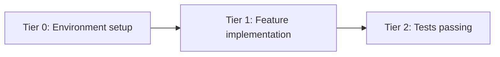
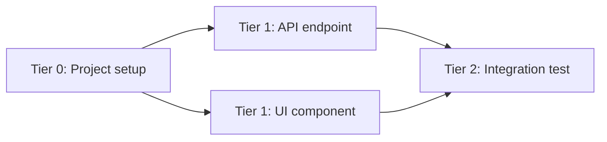

# DAG Task Graph

This skill provides a structured approach to modeling multi-step work as a Directed Acyclic Graph (DAG) with explicit dependencies, blocking semantics, and persistent state tracking. It turns implicit task ordering into a formal, inspectable execution plan.

## When to Use

- Multi-step orchestration with explicit dependencies between tasks
- When tasks must block until predecessors complete
- Parallel execution planning (identify which tasks can run concurrently)
- Complex refactoring or migration with ordered phases
- Any workflow where "what can run next" depends on "what has finished"

## When NOT to Use

| Instead of dag-task-graph | Use |
| --- | --- |
| Simple sequential checklist | TodoWrite |
| Multi-session construction plan | `blueprint` |
| RFC-driven unit decomposition | `ralphinho-rfc-pipeline` |
| One-off parallel agents | `team-builder` |

## Core Concepts

### Task States

Tasks follow a strict state machine:

```
blocked → pending → in_progress → completed
                  → failed
                  ^ (retry)
```

- `blocked` — Has unmet dependencies; cannot be started
- `pending` — All dependencies met; ready for execution
- `in_progress` — Currently being worked on by an agent
- `completed` — Successfully finished
- `failed` — Execution failed; may be retried

### Automatic State Transitions

- When all dependencies of a `blocked` task reach `completed`, the task transitions to `pending`
- When a `failed` task's dependencies are all still `completed`, it may transition back to `pending` (retry)

## Data Model

The execution graph is persisted as `task-graph.json`:

```json
{
  "version": 1,
  "tasks": [
    {
      "id": "string (unique, kebab-case)",
      "title": "human-readable name",
      "description": "what this task produces",
      "status": "blocked|pending|in_progress|completed|failed",
      "dependencies": ["task-id-1", "task-id-2"],
      "owner": "agent-id|null",
      "tier": "number (computed from dependency depth)",
      "created_at": "ISO timestamp",
      "started_at": "ISO timestamp|null",
      "completed_at": "ISO timestamp|null",
      "result_summary": "brief outcome|null",
      "metadata": {}
    }
  ],
  "edges": [
    { "from": "task-id-1", "to": "task-id-2" }
  ]
}
```

## Workflow

### Phase 1: Decompose

Break the objective into discrete tasks. Each task should have a single, verifiable outcome. Identify dependencies — which task's output is another task's input.

### Phase 2: Model

Create the `task-graph.json` with all tasks and edges. Validate:
- No cycles (DAG property)
- No orphaned tasks
- Every dependency references an existing task ID

### Phase 3: Tier Assignment

Compute tiers automatically:
- **Tier 0** = no dependencies
- **Tier N** = max(dependency tiers) + 1

Tasks in the same tier CAN run in parallel.

### Phase 4: Execute

1. Pick the next executable task (`status=pending`, oldest tier first)
2. Assign an owner
3. Transition to `in_progress`
4. On completion, update status and trigger dependency resolution (check if any `blocked` tasks should now transition to `pending`)

### Phase 5: Monitor

Inspect the graph:
- How many tasks per status
- Which tier is active
- What's blocked and why
- Detect stuck states (`in_progress` too long, all tasks blocked with no `pending`)

## Operations

These operations are performed by an orchestrator or worker against the graph:

- **`task_create(id, title, description, dependencies[])`** — Add a task. Auto-compute initial status (`blocked` if deps exist, `pending` otherwise).
- **`task_update(id, status, result_summary?)`** — Transition state. Validate the transition is legal.
- **`task_list(filter?)`** — List tasks, optionally filtered by status or tier.
- **`task_unblock()`** — Scan all `blocked` tasks, transition to `pending` if all deps completed.
- **`graph_validate()`** — Check for cycles, orphaned references, illegal states.
- **`graph_visualize()`** — Generate a Mermaid diagram of the current DAG state (reference `mermaid-diagrams` skill).

## Validation Rules

1. **No cycles** — A task cannot transitively depend on itself
2. **No forward references** — Dependencies must reference existing task IDs
3. **Legal transitions only**: `blocked→pending` (auto), `pending→in_progress`, `in_progress→completed`, `in_progress→failed`, `failed→pending` (retry)
4. **Single owner** — A task can only have one owner at a time
5. **Idempotent unblock** — Running `task_unblock` multiple times produces the same result

## Persistence

Default location: `.factory/artifacts/task-graph.json` (for project-level graphs)

Alternative: Inline in mission state files for mission-scoped graphs.

The graph must survive session boundaries. Write after every mutation.

## Integration Points

- **With blueprint**: Blueprint generates the initial plan; dag-task-graph tracks execution
- **With autonomous-task-claiming**: The DAG provides the task pool that workers claim from
- **With agent-messaging-protocol**: Workers can send status updates through the message layer
- **With background-job-injection**: Long-running tasks can be fire-and-forget with results injected later
- **With mermaid-diagrams**: Visualize the DAG with tier-aware layout

## Safety Guards

- Maximum task count per graph: 100
- Cycle detection on every `task_create`
- Timeout detection: flag tasks `in_progress` longer than a configurable threshold
- No auto-retry without explicit policy

## Best Practices

- Keep tasks atomic (one clear deliverable per task)
- Name tasks by their OUTPUT, not their process (`api-endpoint-created` not `write-api-code`)
- Set dependencies conservatively — only where output genuinely feeds input
- Use tiers for parallel execution planning, not priority
- Persist after every mutation

## Anti-Patterns

- Monolithic tasks that hide sub-dependencies
- Circular dependency chains (invalid DAG)
- Using status as priority (status tracks progress, not importance)
- Over-connecting: not every task needs a dependency
- Mutating `task-graph.json` without validation

## Examples

### Example 1: Linear Chain

A 3-task pipeline where each step depends on the previous:

```json
{
  "version": 1,
  "tasks": [
    {
      "id": "env-setup",
      "title": "Environment setup",
      "description": "Project scaffolding and dependencies installed",
      "status": "pending",
      "dependencies": [],
      "owner": null,
      "tier": 0,
      "created_at": "2026-01-15T10:00:00Z",
      "started_at": null,
      "completed_at": null,
      "result_summary": null,
      "metadata": {}
    },
    {
      "id": "feature-implemented",
      "title": "Feature implementation",
      "description": "Core feature code written and compiling",
      "status": "blocked",
      "dependencies": ["env-setup"],
      "owner": null,
      "tier": 1,
      "created_at": "2026-01-15T10:00:00Z",
      "started_at": null,
      "completed_at": null,
      "result_summary": null,
      "metadata": {}
    },
    {
      "id": "tests-passing",
      "title": "Tests passing",
      "description": "Unit and integration tests written and green",
      "status": "blocked",
      "dependencies": ["feature-implemented"],
      "owner": null,
      "tier": 2,
      "created_at": "2026-01-15T10:00:00Z",
      "started_at": null,
      "completed_at": null,
      "result_summary": null,
      "metadata": {}
    }
  ],
  "edges": [
    { "from": "env-setup", "to": "feature-implemented" },
    { "from": "feature-implemented", "to": "tests-passing" }
  ]
}
```

Mermaid visualization:



### Example 2: Diamond DAG (Parallel Execution)

Setup fans out to two parallel tracks (API and UI), which converge at integration testing:

```json
{
  "version": 1,
  "tasks": [
    {
      "id": "project-setup",
      "title": "Project setup",
      "description": "Monorepo scaffolded with shared config",
      "status": "completed",
      "dependencies": [],
      "owner": "agent-1",
      "tier": 0,
      "created_at": "2026-01-15T10:00:00Z",
      "started_at": "2026-01-15T10:01:00Z",
      "completed_at": "2026-01-15T10:05:00Z",
      "result_summary": "Monorepo initialized with Turborepo",
      "metadata": {}
    },
    {
      "id": "api-endpoint-created",
      "title": "API endpoint created",
      "description": "REST endpoint returning correct schema",
      "status": "pending",
      "dependencies": ["project-setup"],
      "owner": null,
      "tier": 1,
      "created_at": "2026-01-15T10:00:00Z",
      "started_at": null,
      "completed_at": null,
      "result_summary": null,
      "metadata": {}
    },
    {
      "id": "ui-component-rendered",
      "title": "UI component rendered",
      "description": "React component rendering with mock data",
      "status": "pending",
      "dependencies": ["project-setup"],
      "owner": null,
      "tier": 1,
      "created_at": "2026-01-15T10:00:00Z",
      "started_at": null,
      "completed_at": null,
      "result_summary": null,
      "metadata": {}
    },
    {
      "id": "integration-tested",
      "title": "Integration test passing",
      "description": "E2E test verifying UI calls API and renders response",
      "status": "blocked",
      "dependencies": ["api-endpoint-created", "ui-component-rendered"],
      "owner": null,
      "tier": 2,
      "created_at": "2026-01-15T10:00:00Z",
      "started_at": null,
      "completed_at": null,
      "result_summary": null,
      "metadata": {}
    }
  ],
  "edges": [
    { "from": "project-setup", "to": "api-endpoint-created" },
    { "from": "project-setup", "to": "ui-component-rendered" },
    { "from": "api-endpoint-created", "to": "integration-tested" },
    { "from": "ui-component-rendered", "to": "integration-tested" }
  ]
}
```

Mermaid visualization:



Tier 1 tasks (`api-endpoint-created` and `ui-component-rendered`) can execute in parallel since they share no dependencies between each other.

## Related Skills

- `blueprint`
- `ralphinho-rfc-pipeline`
- `autonomous-task-claiming`
- `agent-messaging-protocol`
- `mermaid-diagrams`
- `continuous-agent-loop`
