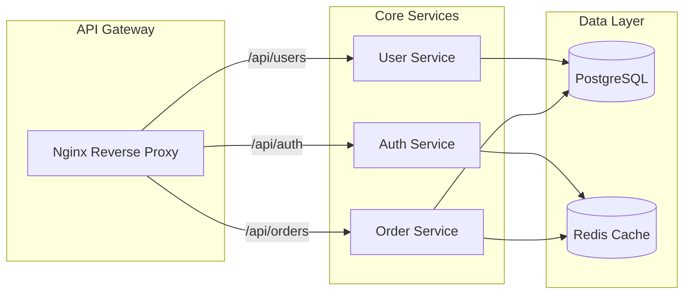
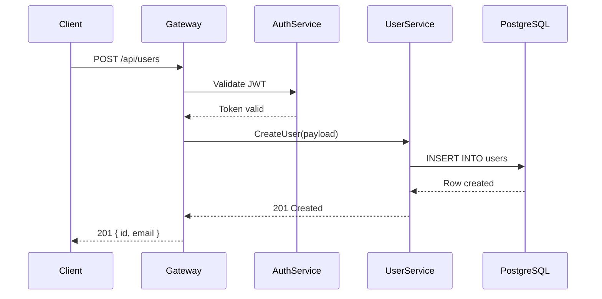
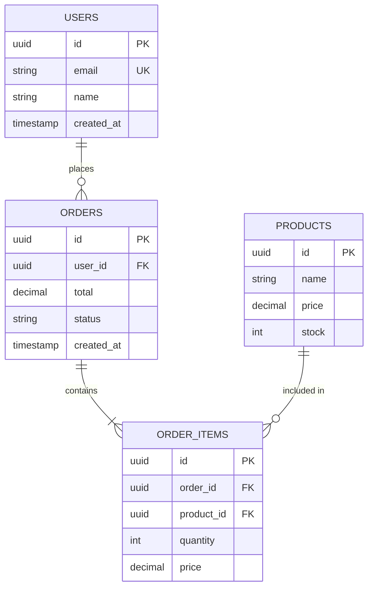

# Mermaid Diagrams

Generate syntactically valid Mermaid diagrams derived from actual codebase analysis. Supports architecture overviews, data flow, dependency graphs, sequence diagrams, ER diagrams, and C4 system context — all grounded in real code, not assumptions.

## When to Use

- User asks for a "diagram", "architecture diagram", "flowchart", or "sequence diagram"
- User says "visualize this", "show me the flow", or "diagram the dependencies"
- User wants to understand how components connect or how data moves through the system
- User asks for an ER diagram or database schema visualization
- User says "map the architecture" or "draw the request path"
- User wants to add a Mermaid diagram to documentation or a README

## When NOT to Use

| Instead of mermaid-diagrams | Use |
| --- | --- |
| Animated or narrated technical explainer video | `manim-video` |
| Monitoring dashboard with live metrics | `dashboard-builder` |
| Token-lean text-based architecture docs | `update-codemaps` command |
| Guided step-by-step code walkthrough | `code-tour` |

## Supported Diagram Types

| Type | Keyword | Best For |
| --- | --- | --- |
| Flowchart | `flowchart` | Architecture overview, request flow, module relationships |
| Sequence Diagram | `sequenceDiagram` | API call chains, auth flows, multi-service interactions |
| Class Diagram | `classDiagram` | OOP hierarchies, interface contracts, type relationships |
| ER Diagram | `erDiagram` | Database schema, entity relationships |
| State Diagram | `stateDiagram-v2` | State machines, lifecycle transitions |
| C4 Context | `C4Context` | System context, external actor boundaries |
| C4 Container | `C4Container` | Container diagrams, service decomposition |
| Graph | `graph` | Dependency graphs, import trees |
| Git Graph | `gitGraph` | Branch strategies, release flows |

## Workflow

### Phase 1: Discover

Scan the codebase to build a mental model of components and their relationships:

1. **Directory structure** — use Glob to map top-level and key nested directories
2. **Entry points** — find `main.*`, `index.*`, `app.*`, `server.*`, `cmd/`
3. **Config files** — read `package.json`, `tsconfig.json`, `docker-compose.*`, CI configs
4. **Imports and exports** — use Grep to trace cross-module dependencies
5. **Database models** — find schema files, migration directories, ORM models

Do not start generating until you understand the shape of the code.

### Phase 2: Scope

Determine the diagram type based on the user request:

| Request Pattern | Default Type |
| --- | --- |
| "architecture", "system overview" | `flowchart` or `C4Context` |
| "how does X call Y", "request flow" | `sequenceDiagram` |
| "class hierarchy", "types", "interfaces" | `classDiagram` |
| "database", "schema", "tables" | `erDiagram` |
| "state machine", "lifecycle" | `stateDiagram-v2` |
| "dependencies", "imports" | `graph` |
| "branching strategy" | `gitGraph` |

If the request is ambiguous, suggest the best-fit type before generating.

### Phase 3: Generate

Produce syntactically valid Mermaid code following these rules:

- Use meaningful node IDs derived from code terminology (e.g., `auth_middleware`, `user_service`)
- Group related nodes in subgraphs with descriptive labels
- Add edge labels for protocol names, method calls, or data types
- Keep the diagram focused on one concern

### Phase 4: Validate

Check the generated diagram against Mermaid syntax rules before presenting:

- Direction is declared for flowcharts
- All labels with special characters are wrapped in quotes
- Node IDs are alphanumeric with underscores only
- Subgraphs are properly opened and closed
- No duplicate node IDs exist
- Pipe characters in labels are escaped

If validation fails, fix the syntax before outputting.

### Phase 5: Output

Write the diagram to the requested location or present inline:

- Default file name: `architecture.mmd` in the project root or `docs/` directory
- For inline output, use a fenced code block with the `mermaid` language tag
- For embedding in Markdown, inject inside a fenced code block in the target file

## Mermaid Syntax Rules

Follow these guardrails to avoid common rendering failures:

1. **Always declare direction** for flowcharts — use `TB`, `LR`, `RL`, or `BT`
2. **Wrap labels with special characters** in quotes: `A["Label with (parens)"]`
3. **Use `:::className` for styling** — never use inline CSS styles
4. **Node IDs must be alphanumeric + underscores** — no hyphens, no dots, no spaces
5. **Subgraph IDs follow the same rules** as node IDs
6. **Escape pipe characters** in labels with quotes
7. **Keep diagrams under ~50 nodes** for readability — split into multiple diagrams if larger
8. **Use `%%` for comments** inside Mermaid blocks

## Output Options

### Inline (in conversation)

Present the diagram in a fenced code block:

````

````

### Standalone file

Write to a `.mmd` file with a frontmatter comment:

```
%% Generated by mermaid-diagrams skill
%% Source: <project name>
%% Date: YYYY-MM-DD

flowchart LR
  ...
```

### Embedded in Markdown

Inject into an existing `.md` file inside a fenced code block with the `mermaid` language tag. Preserve surrounding content.

## Best Practices

- Derive diagrams from actual code — read files, trace imports, check configs
- Use descriptive node labels that match code terminology exactly
- Group related nodes in subgraphs to show logical boundaries
- Show data flow direction with labeled arrows
- Add edge labels for protocol names, HTTP methods, or function signatures
- Keep one diagram per concern — do not mix architecture and sequence in one diagram
- Prefer `flowchart` over `graph` when direction matters (flowchart supports more features)
- Use notes in sequence diagrams to explain non-obvious interactions

## Anti-Patterns

| Anti-pattern | Fix |
| --- | --- |
| Generating diagrams without reading the codebase | Always run Phase 1 first |
| Using generic labels (Service A, Component B) | Use actual names from the code |
| Mixing multiple diagram types in one diagram | Split into separate diagrams |
| Creating diagrams so large they are unreadable | Cap at ~50 nodes, split if larger |
| Hardcoding implementation details that change frequently | Focus on stable interfaces and boundaries |
| Using hyphens or dots in node IDs | Stick to alphanumeric + underscores |

## Examples

### Microservices Architecture Flowchart



### API Request Sequence Diagram



### Database ER Diagram



## Related Skills

- `codebase-onboarding` — understand codebase structure before diagramming
- `hexagonal-architecture` — ports and adapters patterns to visualize
- `architecture-decision-records` — pair diagrams with decision rationale
- `code-tour` — guided walkthroughs complement static diagrams
- `blueprint` — multi-session planning with architecture context
