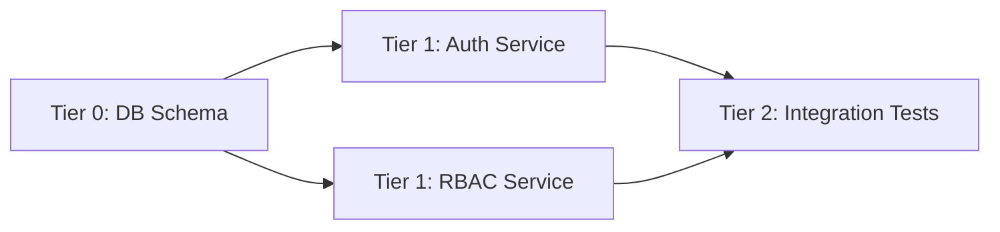

# Mission Dispatcher

This skill is the unified orchestration layer that closes the loop between AO-Pack's five infrastructure components. It answers a single question: given a mission objective, how do you decompose it into tasks, match each task to the right agent, dispatch them with proper isolation, and merge results back — all within Factory Droid's native capabilities (Task tool, Custom Droids, Skills, Hooks) rather than external shell scripts.

Mission Dispatcher connects `dag-task-graph` (decomposition), `autonomous-task-claiming` (pull-based assignment), `git-worktree-isolation` (parallel safety), `agent-messaging-protocol` (coordination), and `background-job-injection` (async results) into a single end-to-end workflow. Each phase below references the underlying skill so you can drop down to the primitive when you need finer control.

## When to Use

- Multi-agent missions where different tasks need different specialists
- Parallel feature development with file-level isolation
- Any workflow that outgrows sequential `/orchestrate` handoffs
- When you need DAG-aware dependency tracking, not just a todo list
- When you want to leverage EFD's 47 specialized agents for specific task types

## When NOT to Use

| Instead | Use |
| --- | --- |
| **Factory Droid native Missions is available** | `/missions` (or `/enter-mission`) — the platform-native system supersedes this skill for all mission-scale work. It provides the same DAG planning, worker dispatch, and milestone tracking natively, plus configuration inheritance (skills, hooks, droids, MCP). Use this skill only when the native `/missions` feature is unavailable or you need fine-grained control over individual AO-Pack primitives. |
| Simple sequential handoff | `/orchestrate` command |
| One-shot sub-agent delegation | Task tool directly |
| External DevFleet orchestration | `claude-devfleet` skill |
| Planning only (no execution) | `blueprint` skill |
| Simple parallel dispatch | `team-builder` skill |

## Architecture Overview

The seven phases form a linear pipeline. Phases 4–5 loop per tier until all tasks resolve.

```
Mission Objective
    │
    ▼
┌─────────────────────────────┐
│   Phase 1: Decompose        │  ← dag-task-graph
│   Objective → Task Graph    │
└─────────────┬───────────────┘
              │
              ▼
┌─────────────────────────────┐
│   Phase 2: Match            │  ← Agent capabilities
│   Task → Agent Assignment   │
└─────────────┬───────────────┘
              │
              ▼
┌─────────────────────────────┐
│   Phase 3: Isolate          │  ← git-worktree-isolation
│   Create per-task worktree  │
└─────────────┬───────────────┘
              │
              ▼
┌─────────────────────────────┐
│   Phase 4: Dispatch         │  ← Task tool + agent prompt
│   Spawn agent in worktree   │
└─────────────┬───────────────┘
              │
              ▼
┌─────────────────────────────┐
│   Phase 5: Track            │  ← autonomous-task-claiming
│   Monitor, retry, unblock   │
└─────────────┬───────────────┘
              │
              ▼
┌─────────────────────────────┐
│   Phase 6: Merge            │  ← git-worktree-isolation
│   Merge worktree → main     │
└─────────────┬───────────────┘
              │
              ▼
┌─────────────────────────────┐
│   Phase 7: Report           │  ← agent-messaging-protocol
│   Collect handoffs, report  │
└─────────────────────────────┘
```

## Phase 1: Decompose (dag-task-graph)

Turn the mission objective into a DAG of discrete tasks. Follow the `dag-task-graph` data model and extend each node with a `required_capabilities` field for agent matching.

**Steps:**

1. Analyze the objective and identify discrete units of work. Each unit should have a single, verifiable deliverable.
2. Each unit becomes a task node with: `id`, `title`, `description`, `dependencies`, `required_capabilities`.
3. Assign tiers automatically — Tier 0 = no dependencies, Tier N = max(dependency tiers) + 1.
4. Tasks in the same tier can execute in parallel.
5. Validate the graph: no cycles, no orphans, every dependency references an existing task ID.
6. Write to `.factory/artifacts/task-graph.json`.

**Extended task model** (adds `required_capabilities` and `worktree_isolation` to the `dag-task-graph` schema):

```json
{
  "id": "auth-service",
  "title": "Implement auth service",
  "description": "JWT-based authentication with refresh token rotation",
  "status": "blocked",
  "dependencies": ["db-schema"],
  "required_capabilities": ["typescript", "security", "api-design"],
  "worktree_isolation": true,
  "owner": null,
  "tier": 1,
  "created_at": "2026-04-10T10:00:00Z",
  "started_at": null,
  "completed_at": null,
  "result_summary": null,
  "metadata": {}
}
```

**Decomposition heuristics:**

- One task per independently testable deliverable
- If two units modify overlapping files, make one depend on the other (serialize shared-file access)
- If a unit needs review or approval, make that a separate task
- Prefer narrow tasks (1–3 files) over broad ones (10+ files)

## Phase 2: Match (Agent Capability Matching)

Assign each task to the best-fit agent from the repo's `agents/*.md` collection.

### Agent capability registry

Each agent in `agents/*.md` declares capabilities in its frontmatter or description. For matching purposes, derive a capability profile:

```yaml
# Example: agents/security-reviewer.md frontmatter
name: security-reviewer
description: Security specialist for auth, crypto, and vulnerability analysis
capabilities: [typescript, security, code-review, api-design]
domain: security
worktree-safe: true
```

If an agent's frontmatter does not include explicit `capabilities`, infer them from the description and the agent's listed tools.

### Matching algorithm (simple, deterministic)

1. **Filter**: Select agents whose `capabilities` include ALL of the task's `required_capabilities`.
2. **Rank**: Among matches, prefer the agent whose `domain` best matches the task's primary concern (first capability listed).
3. **Tiebreak**: If multiple agents remain, prefer the most specialized one (fewest extra capabilities beyond the required set).
4. **Fallback**: If no agent matches, assign the generic `worker` droid.

### Manual override

The orchestrator can always pin a specific agent to a task:

```json
{
  "id": "auth-service",
  "assigned_agent": "security-reviewer"
}
```

When `assigned_agent` is present, skip the matching algorithm entirely.

### Match output

Record assignments in `task-graph.json` by setting `owner` to the matched agent name. This makes assignments inspectable before dispatch.

## Phase 3: Isolate (git-worktree-isolation)

Create an isolated execution environment for each task. Follows the `git-worktree-isolation` skill protocol.

**For tasks with `worktree_isolation: true`:**

1. Create branch: `git branch task/{task-id} HEAD`
2. Create worktree: `git worktree add ../worktree-{task-id} task/{task-id}`
3. Seed shared files (`.env`, `node_modules` via symlink, `.factory/settings.json`)
4. Record binding in `.factory/artifacts/worktree-bindings.json`

**For tasks with `worktree_isolation: false`:**

- Execute in the main working directory
- These tasks MUST run sequentially — use DAG dependencies to enforce ordering
- Suitable for tasks that only read files or touch a single config

**Decision guide:**

| Condition | Set `worktree_isolation` to |
| --- | --- |
| Task modifies source files | `true` |
| Task runs in parallel with other file-modifying tasks | `true` |
| Task is read-only (analysis, review) | `false` |
| Task modifies only `.factory/` artifacts | `false` |

## Phase 4: Dispatch (Task Tool Integration)

The critical bridge — spawn agents via the Task tool with the matched agent's knowledge injected into the prompt.

### Pattern A: Worker + Agent Prompt Injection (Recommended)

Read the matched agent's markdown file and inject it as the worker's system context. This is the most portable pattern — works with any agent definition.

```
Task(
  subagent_type = "worker",
  description = "Execute task: {task.title}",
  prompt = """
    You are acting as: {agent.name}
    {agent.markdown_content}

    ## Task
    {task.description}

    ## Working Directory
    {worktree_path or project_root}

    ## Dependencies Completed
    {list of completed dependency tasks with their result_summaries}

    ## Expected Output
    Complete the task and write a handoff report to:
    .factory/handoffs/{task.id}.json

    ## Handoff Format
    {{
      "task_id": "{task.id}",
      "agent": "{agent.name}",
      "status": "completed|failed|partial",
      "started_at": "ISO timestamp",
      "completed_at": "ISO timestamp",
      "files_changed": [],
      "test_results": {{ "total": 0, "passed": 0, "failed": 0 }},
      "summary": "brief description of what was done",
      "issues_discovered": [],
      "recommendation": "SHIP|NEEDS_WORK|BLOCKED",
      "handoff_context": "context the next dependent task needs"
    }}
  """
)
```

### Pattern B: Named Custom Droid (When Available)

If the matched agent has a corresponding Custom Droid definition in `.factory/droids/`, use it directly:

```
Task(
  subagent_type = "{agent.name}",
  description = "Execute task: {task.title}",
  prompt = """
    ## Task
    {task.description}

    ## Working Directory
    {worktree_path or project_root}

    ## Dependencies Completed
    {dependency summaries}

    ## Expected Output
    Write handoff report to .factory/handoffs/{task.id}.json
  """
)
```

### Parallel dispatch

- All Tier-N tasks with `pending` status can be dispatched simultaneously.
- Use multiple Task tool calls in the same message for parallelism.
- Factory Droid natively supports parallel Task invocations.
- Respect the max concurrent dispatches limit (default 3).

### Dispatch checklist

Before each dispatch call:

1. Verify the task's status is `pending` (all dependencies completed)
2. Verify worktree exists (if `worktree_isolation: true`)
3. Check the circuit breaker (session dispatch count < max)
4. Check the emergency stop sentinel (`.factory/artifacts/ao-pack-stop`)
5. Update `task-graph.json`: set `status: in_progress`, `started_at: now`

## Phase 5: Track (Status Management)

After dispatch, monitor task completion and trigger downstream work.

**On Task tool return:**

1. Read the handoff report from `.factory/handoffs/{task.id}.json`.
2. Validate the handoff against the standardized schema (see below).
3. If `status: completed`:
   - Update `task-graph.json`: `status → completed`, write `result_summary`
   - Run `task_unblock()` — scan blocked tasks whose dependencies are now all completed, transition them to `pending`
4. If `status: failed`:
   - Update `task-graph.json`: `status → failed`, increment `claim_count`
   - If `claim_count < max_retries` (default 3): transition back to `pending` for retry
   - If `claim_count >= max_retries`: leave as `failed`, report to orchestrator
5. If `status: partial`:
   - Treat as `failed` but preserve the `handoff_context` for the retry attempt

**Autonomous claiming (optional, for continuous loops):**

When running in a continuous loop (see `autonomous-task-claiming`):

1. Check circuit breaker (`session_claims < max_session_claims`)
2. If claims remaining and pending tasks exist → dispatch next eligible task
3. If no pending tasks and all tasks completed → proceed to Phase 6
4. If no pending tasks but some are blocked/failed → exit and report

## Phase 6: Merge (Worktree Resolution)

After task completion, merge isolated work back to the main branch. Follows `git-worktree-isolation` merge protocol.

**Steps:**

1. Verify the handoff report confirms `status: completed` and `recommendation: SHIP`.
2. Merge the worktree branch back:
   - Default: `git merge --squash task/{task-id}` (clean single commit per task)
   - Commit message: `feat({task-id}): {task.title}`
3. If merge conflicts:
   - Do NOT auto-resolve
   - Report conflict details to the orchestrator (file list, conflict markers)
   - Mark task as `needs_merge_resolution` in task-graph.json
4. Cleanup:
   - `git worktree remove ../worktree-{task-id}`
   - `git branch -d task/{task-id}`
   - Update `worktree-bindings.json`: set binding status to `cleaned`

**Merge ordering matters:** Merge tasks in tier order (Tier 0 first, then Tier 1, etc.) to minimize conflicts. Within a tier, merge in task-id alphabetical order for determinism.

**Skip merge for `worktree_isolation: false` tasks** — their changes are already in the main working directory.

## Phase 7: Report (Handoff Collection)

After all tasks complete (or the mission is aborted), collect results and generate a mission summary.

**Steps:**

1. Collect all handoff reports from `.factory/handoffs/`.
2. Generate a mission summary:

```json
{
  "mission": "Build API auth service with RBAC",
  "status": "completed|partial|failed",
  "tasks": {
    "total": 4,
    "completed": 4,
    "failed": 0,
    "remaining": 0
  },
  "files_changed": ["src/auth.ts", "src/rbac.ts", "tests/auth.test.ts"],
  "test_results": {
    "total": 24,
    "passed": 24,
    "failed": 0
  },
  "issues_discovered": [],
  "timeline": [
    { "task": "db-schema", "duration_seconds": 120 },
    { "task": "auth-service", "duration_seconds": 300 },
    { "task": "rbac-service", "duration_seconds": 240 },
    { "task": "integration-tests", "duration_seconds": 180 }
  ]
}
```

3. Write the summary to `.factory/artifacts/mission-summary.json`.
4. Clean up artifacts (optional): remove individual handoff files, task-graph.json, and worktree bindings if the mission is fully complete.

## Standardized Handoff Schema

Every dispatched agent MUST write this format on completion:

```json
{
  "task_id": "auth-service",
  "agent": "security-reviewer",
  "status": "completed|failed|partial",
  "started_at": "2026-04-10T10:05:00Z",
  "completed_at": "2026-04-10T10:10:00Z",
  "files_changed": ["src/auth.ts", "tests/auth.test.ts"],
  "test_results": {
    "total": 24,
    "passed": 24,
    "failed": 0
  },
  "summary": "Implemented JWT auth with refresh tokens. Added rate limiting on login endpoint.",
  "issues_discovered": [],
  "recommendation": "SHIP|NEEDS_WORK|BLOCKED",
  "handoff_context": "Any context the next dependent task needs"
}
```

**Field rules:**

| Field | Required | Notes |
| --- | --- | --- |
| `task_id` | Yes | Must match the task's `id` in task-graph.json |
| `agent` | Yes | The agent name that executed the task |
| `status` | Yes | One of: `completed`, `failed`, `partial` |
| `started_at` | Yes | ISO 8601 timestamp |
| `completed_at` | Yes | ISO 8601 timestamp |
| `files_changed` | Yes | Array of relative paths; empty array if none |
| `test_results` | No | Omit if the task does not involve tests |
| `summary` | Yes | Max 500 chars; what was done, not how |
| `issues_discovered` | No | Array of strings; empty array if none |
| `recommendation` | Yes | `SHIP` = ready to merge, `NEEDS_WORK` = fixable issues, `BLOCKED` = cannot proceed |
| `handoff_context` | No | Free-text context for downstream tasks |

## Complete Workflow Example

**Mission:** Build an API auth service with RBAC support.

### Step 1 — Decompose

Analyze the objective and produce four tasks:

```json
{
  "version": 1,
  "tasks": [
    {
      "id": "db-schema",
      "title": "Design database schema for users and roles",
      "description": "Create Prisma schema with User, Role, and Permission models. Run migration.",
      "status": "pending",
      "dependencies": [],
      "required_capabilities": ["typescript", "database"],
      "worktree_isolation": false,
      "owner": null,
      "tier": 0
    },
    {
      "id": "auth-service",
      "title": "Implement JWT auth service",
      "description": "Login/register endpoints with JWT access + refresh tokens. Rate-limit login.",
      "status": "blocked",
      "dependencies": ["db-schema"],
      "required_capabilities": ["typescript", "security", "api-design"],
      "worktree_isolation": true,
      "owner": null,
      "tier": 1
    },
    {
      "id": "rbac-service",
      "title": "Implement RBAC middleware",
      "description": "Role-based access control middleware. Permission checks on protected routes.",
      "status": "blocked",
      "dependencies": ["db-schema"],
      "required_capabilities": ["typescript", "security"],
      "worktree_isolation": true,
      "owner": null,
      "tier": 1
    },
    {
      "id": "integration-tests",
      "title": "Write integration tests for auth + RBAC",
      "description": "End-to-end tests: register, login, access protected route with/without role.",
      "status": "blocked",
      "dependencies": ["auth-service", "rbac-service"],
      "required_capabilities": ["typescript", "testing"],
      "worktree_isolation": false,
      "owner": null,
      "tier": 2
    }
  ],
  "edges": [
    { "from": "db-schema", "to": "auth-service" },
    { "from": "db-schema", "to": "rbac-service" },
    { "from": "auth-service", "to": "integration-tests" },
    { "from": "rbac-service", "to": "integration-tests" }
  ]
}
```

DAG visualization:



### Step 2 — Match

| Task | Required Capabilities | Matched Agent | Reason |
| --- | --- | --- | --- |
| db-schema | typescript, database | architect | Domain: architecture, has database capability |
| auth-service | typescript, security, api-design | security-reviewer | Domain: security, full capability match |
| rbac-service | typescript, security | security-reviewer | Domain: security, exact match |
| integration-tests | typescript, testing | tdd-guide | Domain: testing, exact match |

### Step 3 — Isolate

- `db-schema`: `worktree_isolation: false` → runs in main directory
- `auth-service`: `git worktree add ../worktree-auth-service task/auth-service`
- `rbac-service`: `git worktree add ../worktree-rbac-service task/rbac-service`
- `integration-tests`: `worktree_isolation: false` → runs in main directory (after merges)

### Step 4 — Dispatch

**Round 1 (Tier 0):** Dispatch `db-schema` to architect in main directory. Single Task call.

**Round 2 (Tier 1):** After `db-schema` completes, dispatch `auth-service` and `rbac-service` simultaneously — two parallel Task calls in the same message, each pointing at its respective worktree.

**Round 3 (Tier 2):** After both Tier 1 tasks complete and merge, dispatch `integration-tests` to tdd-guide in the main directory.

### Step 5 — Track

After each Task tool returns:
- Read `.factory/handoffs/{task-id}.json`
- Update task-graph.json status
- Run `task_unblock()` to promote blocked → pending

### Step 6 — Merge

1. `db-schema` — no worktree, changes already in main
2. `git merge --squash task/auth-service` → commit `feat(auth-service): Implement JWT auth service`
3. `git merge --squash task/rbac-service` → commit `feat(rbac-service): Implement RBAC middleware`
4. Cleanup both worktrees and branches
5. `integration-tests` — no worktree, changes already in main

### Step 7 — Report

Collect all four handoff reports. Generate mission summary: 4/4 tasks completed, 24/24 tests passing, 0 issues discovered. Write to `.factory/artifacts/mission-summary.json`.

## Integration with Factory Droid Missions

How mission-dispatcher works WITHIN the Mission system:

- The Mission orchestrator uses this skill to plan feature decomposition when a feature is too complex for a single agent
- Features in `features.json` can reference `task-graph.json` for dependency tracking
- Worker skills can invoke mission-dispatcher recursively for sub-task orchestration (with a separate task-graph file to avoid collisions)
- The orchestrator reads handoff reports to inform next feature planning
- Background jobs (via `background-job-injection`) can be registered during dispatch and their results injected before the next orchestration round

## Safety Guards

- **Max concurrent dispatches**: Default 3 parallel agents. Prevents resource exhaustion and excessive context usage. Configurable per mission.
- **Merge conflict resolution**: Never auto-resolve. Report to orchestrator with file list and conflict markers. The orchestrator or human decides.
- **Worktree cleanup on failure**: Always clean up worktrees, even on task failure. Use `git worktree remove --force` only if necessary, but never delete unmerged branches (`-d` not `-D`).
- **Circuit breaker**: Max 10 total dispatches per session. Prevents runaway loops. After hitting the limit, exit with a summary of remaining work.
- **Handoff validation**: Verify handoff report exists and contains all required fields before marking a task complete. Missing or malformed handoffs → task status `failed`.
- **Emergency stop**: Check `.factory/artifacts/ao-pack-stop` sentinel file before each dispatch. If present, abort the mission immediately and report current state.
- **Retry budget**: Each task allows max 3 retry attempts (configurable via `max_retries`). After exhaustion, the task stays `failed` and requires orchestrator intervention.

## Best Practices

- Start with `worktree_isolation: false` for simple missions with few tasks (less overhead, faster iteration)
- Use parallel dispatch only for genuinely independent tasks (same tier, no shared files)
- Always review handoff reports before merging — check `recommendation` field
- Keep task granularity at "one clear deliverable" level — not too broad (hard to verify), not too narrow (overhead per task)
- Prefer Worker + Agent Prompt Injection (Pattern A) over Named Custom Droids (Pattern B) for portability — Pattern A works with any agent markdown file
- Merge in tier order to minimize conflicts and ensure downstream tasks see all upstream changes
- Use `handoff_context` to pass essential information to dependent tasks rather than expecting them to rediscover it

## Anti-Patterns

- **Dispatching all tasks simultaneously regardless of dependencies** — Violates the DAG. Tier 1 tasks depend on Tier 0 outputs; dispatching them early means they'll work against stale state.
- **Skipping the handoff report** ("it compiled, so it's done") — Without a structured handoff, the orchestrator cannot verify completeness, track test results, or pass context to dependent tasks.
- **Auto-merging without conflict check** — Merge conflicts silently corrupt the codebase. Always check exit codes and conflict markers.
- **Creating worktrees for tasks that modify the same files** — Worktrees isolate file access. If two tasks touch the same file, serialize them via dependencies instead.
- **Using mission-dispatcher for simple 2-step workflows** — Overkill. Use `/orchestrate` or a direct Task tool call for sequential two-step work.
- **Unbounded retries** — A failing task that retries forever wastes tokens and time. Respect the retry budget.
- **Skipping tier-order merges** — Merging Tier 1 before Tier 0 can produce conflicts that wouldn't otherwise exist.

## Related Skills

- `dag-task-graph` — Task decomposition, state machine, and persistent tracking
- `autonomous-task-claiming` — Pull-based task assignment with safety limits
- `git-worktree-isolation` — Worktree creation, seed files, merge-back, and cleanup
- `agent-messaging-protocol` — Inter-agent communication and handoff coordination
- `background-job-injection` — Async result capture for long-running tasks
- `team-builder` — Simple parallel dispatch without DAG dependencies
- `blueprint` — Plan generation without execution
- `claude-devfleet` — External DAG orchestration via DevFleet MCP
- `/orchestrate` command — Sequential handoffs for simpler workflows
